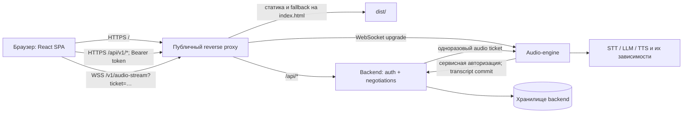

# Развёртывание frontend и схема интеграций

Документ для DevOps и команд backend/audio-engine. Цель развёртывания — вход с
реальной учётной записью и голосовые переговоры с реальным оппонентом. **На дату
составления документа этот сценарий ещё нельзя включить одной настройкой:**
авторизация работает с backend, а `real`-адаптеры переговоров и аудио пока
возвращают `feature-unavailable`. Ниже указаны рабочая схема хостинга, целевой
контракт и условия, после которых можно выпускать сборку без моков.

## Схема



Браузеру нужны только публичные HTTPS и WSS входы. Хранилище, ключи AI и
внутренний endpoint записи транскриптов остаются в приватной сети. Способ
развёртывания backend, audio-engine и их зависимостей определяют владельцы этих
сервисов; в этом репозитории нет их Docker/infra-конфигурации.

## Что реально готово

| Контур | Состояние в frontend | Что даёт деплой сейчас |
| --- | --- | --- |
| Статика и маршруты | `npm run build` создаёт `dist/` | Landing, экраны входа и UI приложения |
| Auth | `BackendAuthClient` отправляет HTTP на `VITE_API_BASE_URL` | Регистрация, активация, login, refresh, logout и TOTP с живым backend |
| Negotiation | `BackendNegotiationClient` — заглушка | `VITE_NEGOTIATION_SOURCE=real` приведёт к `feature-unavailable` |
| Audio | `AudioEngineClient` — заглушка; записи PCM с микрофона нет | `VITE_AUDIO_SOURCE=real` не открывает WebSocket и не передаёт голос |
| Кейсы и прогресс | Каталог кейсов и блок прогресса в `HomePage` локальные | Даже после подключения переговоров эти данные нужно отдельно согласовать или явно оставить демонстрационными |

Существующий `openapi.json` описывает auth и старые `/v1/chat/*`, но **не**
целевой API переговоров. Старый chat CRUD и audio JWT с `chat_uuid` не являются
совместимой заменой описанной ниже схемы. Детали: [README](../README.md#целевой-контракт-переговоров)
и [границы OpenAPI](api.md).

## Сборка и публичные маршруты

1. Использовать Node `24.14.1` (допустимый диапазон `>=24.14.1 <25`) и lockfile:
   `npm ci`, затем `npm run build`. Раздавать содержимое `dist/` статическим
   веб-сервером; Vite dev/preview не является production-сервером.
2. Подключить TLS на публичном домене. Для браузерного микрофона нужен secure
   context (`https://`), для аудио — `wss://`. Не направлять production-клиент
   на `ws://localhost:8000` из `.env.example`: это адрес компьютера посетителя.
3. Для клиентских маршрутов (`/auth`, `/login`, `/register`, `/activate`,
   `/home`, `/arena/:sessionId`, `/result/:sessionId`) возвращать `index.html`
   при прямом открытии и обновлении страницы. `/api/*` и WebSocket путь не должны
   попадать в SPA fallback.
4. Проверить, что письмо активации ведёт на публичный
   `https://<frontend-host>/activate?code=<uuid>`. URL письма настраивается на
   стороне auth backend; экран frontend читает `code` из query string.

`VITE_*` переменные встраиваются в JS **во время сборки**. Их изменение в
окружении статического сервера не переключит уже собранный frontend. Для
production после реализации real-адаптеров нужна сборка с такими значениями:

```dotenv
VITE_AUTH_SOURCE=real
VITE_NEGOTIATION_SOURCE=real
VITE_AUDIO_SOURCE=real
VITE_API_BASE_URL=/api
VITE_API_TIMEOUT_MS=20000
VITE_AUDIO_WS_URL=wss://<frontend-host>/v1/audio-stream
```

`API_PROXY_TARGET` используется только dev-сервером Vite и не настраивает
production-прокси. `VITE_MOCK_LATENCY_MS` не имеет значения для real-режима.
Для промежуточного стенда, который можно развернуть сейчас, использовать те же
адреса API, но собрать с `VITE_AUTH_SOURCE=real`,
`VITE_NEGOTIATION_SOURCE=mock`, `VITE_AUDIO_SOURCE=mock` и явно обозначить стенд
как demo. Не выпускать эту сборку под обещание «голос без моков».
Токены auth хранятся на стороне браузера; запросы backend идут с `Authorization:
Bearer <access_token>`, refresh передаёт refresh token в JSON. Поэтому при
прокси на том же origin CORS для браузера не нужен. Если выбран другой origin,
потребуются отдельные настройки CORS и обновление конфигурации.

### Пример reverse proxy

Ниже **шаблон**, где `backend-gateway` принимает путь `/api/v1/...` и сам
передаёт запрос приложению. Если запросы идут прямо в backend, чей OpenAPI
содержит `/v1/...`, прокси должен удалить `/api` **ровно один раз**. Проверить
это интеграционным запросом до релиза; Vite dev-прокси текущего проекта префикс
`/api` сохраняет.

```nginx
server {
    listen 443 ssl;
    server_name <frontend-host>;
    root /srv/arena-frontend/dist;

    # ssl_certificate и ssl_certificate_key задаются инфраструктурой.

    location /api/ {
        proxy_pass http://backend-gateway;
        proxy_set_header Host $host;
        proxy_set_header X-Forwarded-Proto $scheme;
        proxy_set_header X-Forwarded-For $proxy_add_x_forwarded_for;
    }

    location = /v1/audio-stream {
        proxy_pass http://audio-engine;
        proxy_http_version 1.1;
        proxy_set_header Upgrade $http_upgrade;
        proxy_set_header Connection "upgrade";
        proxy_set_header Host $host;
        proxy_set_header X-Forwarded-Proto $scheme;
        proxy_read_timeout 3600s;
        # Не логировать полный URI: query string содержит одноразовый ticket.
    }

    location / {
        try_files $uri $uri/ /index.html;
    }
}
```

Для прямого upstream backend, который принимает только `/v1/...`, заменить
строку на `proxy_pass http://backend-app/;` внутри `location /api/`: завершающий
`/` удаляет совпавший `/api/`. Это нужно согласовать с фактическим ingress
backend. Перед включением access log исключить ticket из URL WebSocket и
секреты из заголовков/тел запросов. Не кэшировать ответы `/api/`.

## HTTP-сервисы и обмен данными

Auth уже вызывается через `/api/v1/auth/*`: `register`, `register/activate`,
`login`, `token/refresh`, `logout`, `totp/enroll`, `totp/confirm`, `totp`
(DELETE). Форматы запросов/ответов зафиксированы в
[`BackendAuthClient`](../src/services/real/backendAuthClient.ts) и
[`openapi.json`](../openapi.json). Для полного сценария проверить доставку
активационного письма и настройку времени/ключей TOTP на backend.

Целевой negotiation API должен быть доступен браузеру через `/api` и принимать
Bearer access token. Это **согласуемый контракт, ещё не существующая интеграция**:

| Операция | Метод и публичный путь | Назначение |
| --- | --- | --- |
| Создать сессию | `POST /api/v1/negotiations` | `{case_id, mode: "voice"}`; вернуть сессию |
| История сессии | `GET /api/v1/negotiations/{id}` | Восстановление после reload/reconnect |
| Audio ticket | `POST /api/v1/negotiations/{id}/audio-ticket` | Короткоживущий одноразовый ticket для WSS |
| Завершение | `POST /api/v1/negotiations/{id}/finish` | Запуск разбора и состояние результата |
| Разбор | `GET /api/v1/negotiations/{id}/result` | `processing`, `ready` или `failed` |
| История пользователя | `GET /api/v1/negotiations` | Список сессий на главной |
| Текстовый ход | `POST /api/v1/negotiations/{id}/turns/text` | Нужен для текстового режима того же UI |

Командные запросы create, text turn и finish используют `Idempotency-Key` и
сохраняют его при повторе после 401/refresh или сетевой ошибки. Backend должен
проверять владельца сессии по токену. Точные DTO, ошибки и правила
восстановления описаны в [README](../README.md#целевой-контракт-переговоров)
и проверяются в [`targetContract.ts`](../src/services/real/targetContract.ts).
При 401 frontend выполняет один refresh и один повтор запроса.

## Голосовой тракт

1. После создания voice-сессии frontend загружает её с backend и запрашивает
   новый ticket по Bearer token. Backend выдаёт `{ticket, expires_at,
   protocol: "audio-engine.v1"}`, привязывает его к пользователю и session ID.
2. Браузер открывает `wss://<frontend-host>/v1/audio-stream?ticket=<ticket>&protocol=audio-engine.v1`.
   Audio-engine проверяет ticket; при reconnect требуется новый ticket.
3. Браузер отправляет `audio_input` frames: base64 `pcm_s16le`, mono, 24 kHz,
   16 bit, `sequence` и Unix `timestamp` в миллисекундах. `MediaRecorder`/WebM
   нельзя выдавать за PCM. Control events: `pause`, `resume`, `stop`, `close`.
4. Audio-engine возвращает `transcript_partial`, `message_committed`, `audio_frame`,
   `error`, `closed` в формате `audio-engine.v1`. Для каждой финальной реплики
   audio-engine сначала выполняет внутренний
   `POST /v1/internal/negotiations/{sessionId}/transcripts` с сервисной
   авторизацией и идемпотентным `event_id`, затем отправляет браузеру
   `message_committed` с сохранённым `id`/`sequence`.
5. После завершения сессии backend формирует разбор; frontend опрашивает
   endpoint результата, пока состояние `processing`, с ограниченным polling.

Frontend уже умеет отображать входящие PCM-кадры, partial transcript и
сохранённые реплики, но пока **не захватывает и не кодирует микрофонный поток**.
Согласовать с audio-engine handshake, frame size/rate, backpressure,
аутентификацию service-to-service, close codes и судьбу последней неподтверждённой
реплики при finish. WebSocket прокси должен поддерживать Upgrade, длительное
соединение и корректное закрытие при разрыве. Наблюдаемость нужна по session ID,
но без логирования токенов, ticket и аудиопейлоада.

## Условия готовности к запуску без моков

- [ ] Backend реализовал и опубликовал совместимые negotiation endpoint'ы,
  проверку владения, `Idempotency-Key`, результат и внутренний transcript commit.
- [ ] Audio-engine реализовал `audio-engine.v1`, проверку одноразового ticket,
  входящий/исходящий PCM, сохранение реплик и согласованную политику reconnect.
- [ ] Frontend реализовал `BackendNegotiationClient`, `AudioEngineClient` и путь
  `microphone → PCM 24 kHz → sendAudio`, а также убрал demo-подписи из
  включаемых real-экранов. Переключение `VITE_*_SOURCE=real` само этого не делает.
- [ ] DevOps настроили HTTPS/WSS, `/api`, WebSocket Upgrade, SPA fallback,
  backend mail/activation URL и приватную связь audio-engine → backend.
- [ ] На развернутом стенде вручную прошли: регистрация → письмо → активация →
  вход → voice-сессия → двусторонний звук и сохранённые реплики → reload →
  завершение → разбор; отдельно refresh, TOTP и повторное подключение WSS.

Пока эти пункты не выполнены, для демонстрации доступен только поддерживаемый
режим `real/mock/mock`: реальная авторизация с демонстрационными переговорами.
Проверки Playwright используют перехваты и mock-адаптеры, поэтому успешный
`npm run visual:smoke` не доказывает работу живого голосового тракта.
