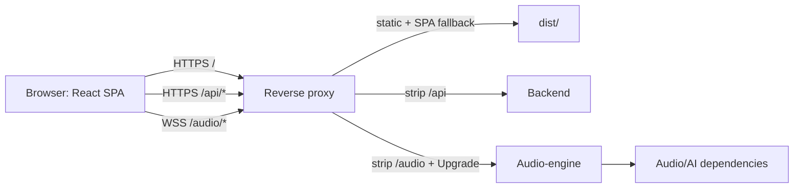

# Развёртывание frontend и интеграции

Документ предназначен для DevOps и владельцев backend/audio-engine. Он
описывает существующий frontend-контур и его известные ограничения, а не
целевую архитектуру будущих сервисов.

## Схема



Frontend поставляется как статическая Vite-сборка. Этот репозиторий не владеет
развёртыванием backend, audio-engine, их хранилищами или AI-зависимостями.

## Что реализовано

| Контур | Реализация frontend |
| --- | --- |
| Auth | HTTP registration, activation, login, refresh, logout и TOTP через `BackendAuthClient` |
| Negotiation | HTTP-каталог кейсов, создание/активация чата, detail и история через `BackendNegotiationClient` |
| Audio | WebSocket через `AudioEngineClient`, control events, reconnect после auth error и backpressure guard |
| Захват | `getUserMedia` + AudioWorklet, преобразование в mono PCM s16le 24 kHz и отправка base64 chunks |
| Воспроизведение | Декодирование входящих PCM frames и очередь Web Audio |
| Результат | `POST /v1/chats/{uuid}/evaluate`, polling `GET /v1/chats/{uuid}/result` и строгая проверка AI-контракта `2.0.0-rc.1` |

Реализация real adapters сама по себе не подтверждает совместимость живых
сервисов. Канонические спецификации и текущий drift описаны в
[contracts.md](contracts.md).

## Сборка и конфигурация

Используйте версию Node из `.node-version` и lockfile:

```shell
npm ci
npm run build
```

Раздавайте содержимое `dist/` статическим сервером. Vite dev/preview не является
production-сервером. Все `VITE_*` переменные встраиваются в JavaScript во время
сборки; изменение окружения статического сервера не меняет готовый bundle.

Основной режим:

```dotenv
VITE_SERVICE_MODE=real
VITE_API_BASE_URL=/api
VITE_AUDIO_WS_URL=/audio/v1/audio-stream
```

`VITE_SERVICE_MODE` обязателен и принимает только `real` или `mock`. В `real`
все три интеграции используют внешние сервисы; в `mock` все три остаются
локальными. Гибридных конфигураций нет. Значения и defaults остальных переменных
перечислены в `.env.example`, а правила режимов — в
[architecture.md](architecture.md).

`API_PROXY_TARGET` и `AUDIO_PROXY_TARGET` используются только Vite dev-
сервером. Production upstream задаётся reverse proxy.

## Требования к публичному хосту

- Использовать HTTPS; браузерный микрофон требует secure context.
- Проксировать `/api/*` в backend с удалением префикса `/api` ровно один раз.
- Проксировать `/audio/*` в audio-engine с удалением `/audio` и WebSocket
  Upgrade.
- Для клиентских маршрутов возвращать `index.html`; API и WebSocket не должны
  попадать в SPA fallback.
- Настроить activation URL как
  `https://<frontend-host>/activate?code=<uuid>`.
- Не логировать Authorization, refresh payload, полный WebSocket URL или аудио:
  текущий WebSocket передаёт access token в query string.

Пример Nginx для upstream, которые принимают `/v1/*`:

```nginx
server {
    listen 443 ssl;
    server_name <frontend-host>;
    root /srv/arena-frontend/dist;

    location /api/ {
        proxy_pass http://backend-app/;
        proxy_set_header Host $host;
        proxy_set_header X-Forwarded-Proto $scheme;
        proxy_set_header X-Forwarded-For $proxy_add_x_forwarded_for;
    }

    location /audio/ {
        proxy_pass http://audio-engine/;
        proxy_http_version 1.1;
        proxy_set_header Upgrade $http_upgrade;
        proxy_set_header Connection "upgrade";
        proxy_set_header Host $host;
        proxy_set_header X-Forwarded-Proto $scheme;
        proxy_read_timeout 3600s;
    }

    location / {
        try_files $uri $uri/ /index.html;
    }
}
```

Если gateway уже ожидает `/api/v1/*` или `/audio/v1/*`, правило удаления
префикса нужно убрать. Фактический upstream path проверяется по спецификации
сервиса перед релизом.

## Потоки данных

Auth-запросы идут с browser на `/api/v1/auth/*`. Защищённые negotiation-запросы
используют Bearer access token; после 401 auth runtime выполняет один refresh и
повтор авторизованной операции.

В real voice flow frontend создаёт чат, активирует его, затем открывает
`/audio/v1/audio-stream?token=<access-token>`. После пользовательского действия
браузер запрашивает микрофон, формирует PCM chunks и отправляет сообщения
`{type: "audio", audio: "..."}`. Audio-engine возвращает PCM и транскрипты.
Каждый `transcript` считается полным завершённым текстом отдельной реплики;
история перечитывается из backend и сверяется по новым `message.id`.

При завершении переговоров frontend запускает evaluation через backend. Страница
результата читает состояние задания до `done` или `failed`; для `done` она
дополнительно получает актуальный транскрипт чата и валидирует привязку evidence
перед отображением. Прямых запросов browser к AI-сервису нет.

## Известные ограничения

- Audio-engine выбирает чат через глобальный для аккаунта `/v1/chats/active`,
  поэтому одновременные voice-подключения в разных вкладках не изолированы.
- WebSocket transcript не содержит backend `message.id`; frontend получает его
  повторным чтением истории.
- Real negotiation поддерживает только voice: текстовый ход отсутствует.
- Отображаемая подготовка берётся только из owner-scoped `localStorage`; server
  preparations и mock fixtures не используются как fallback.
- Полнота `plan_vs_reality` зависит от сохранения `preparations` backend; при
  `null` frontend не подмешивает локальный анализ.
- Нет подтверждённого живого E2E-прогона frontend + backend + audio-engine.

Зелёные frontend-тесты используют adapters и не доказывают работу развёрнутого
голосового тракта.

## Проверка стенда

Перед демонстрацией real-режима вручную проверьте auth/TOTP, загрузку кейсов,
создание и активацию чата, разрешение микрофона, двустороннее аудио, оба
транскрипта, восстановление после reload и обрыва WebSocket, запуск evaluation,
переход `pending/processing` в `done`, соответствие evidence транскрипту и
отсутствие демонстрационной пометки у server result.
